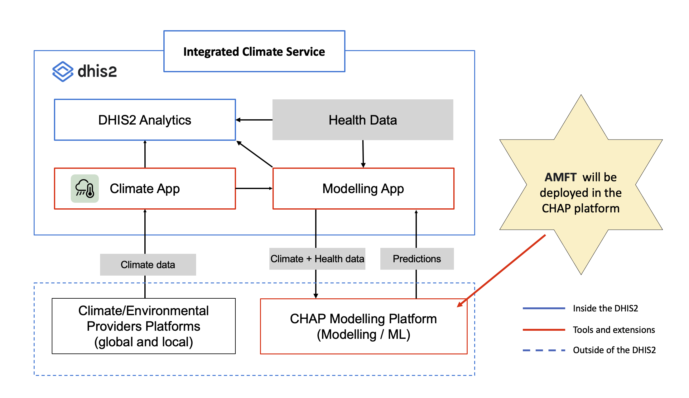
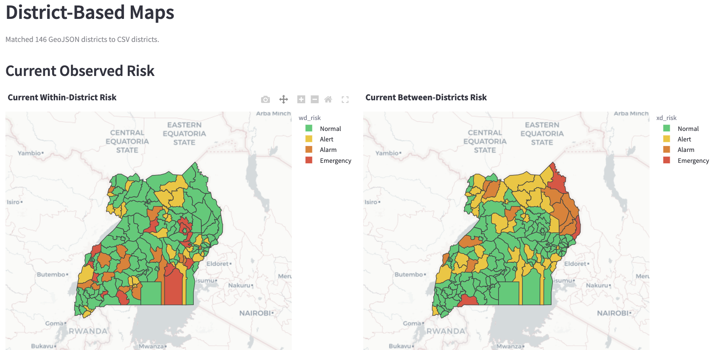
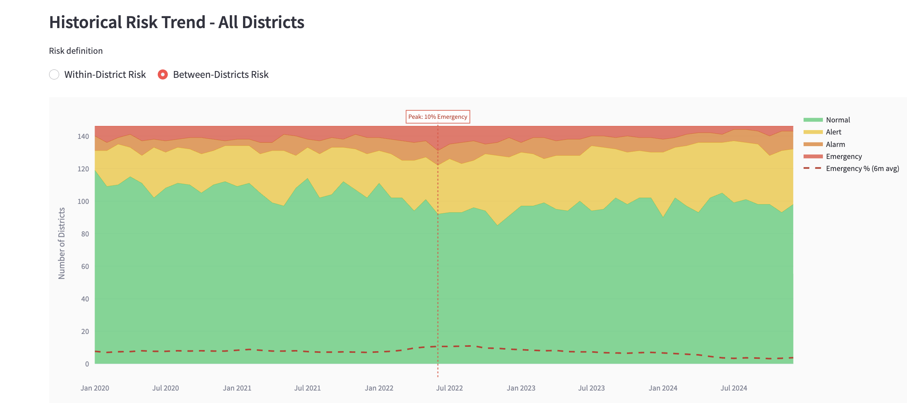
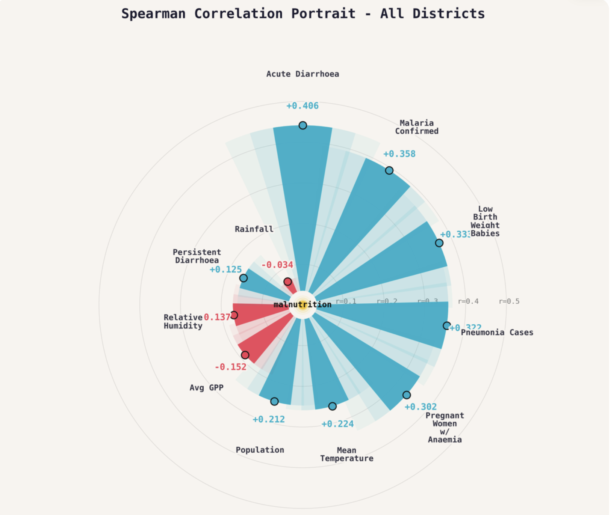
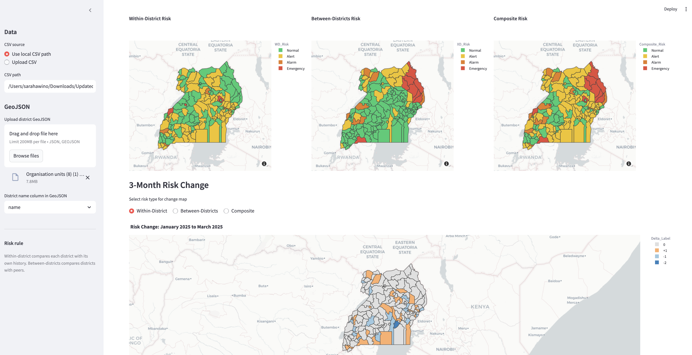

# Acute Malnutrition Forecasting Tool (AMFT)

AMFT is a Streamlit-based decision-support tool for district-level acute malnutrition monitoring in Uganda. It combines anomaly detection, short-term forecasting, geospatial visualization, data quality checks, and model evaluation to support early warning and operational planning.

The current version focuses on two connected outputs:

- 3-level operational alert classification from each district's own history
- separate direct 1-month and 3-month district forecasts of GAM detection rates per 1,000 assessed children with uncertainty bounds

## What Changed in the Current Tool

The README has been updated to reflect the current app behavior. The tool now uses:

- operational alert levels of `Monitor`, `Alert`, and `Respond`
- direct 1-month and 3-month forecasting with `Lower_80` and `Upper_80` intervals
- district filtering across the full app
- observed and forecast map views for within-district anomalies
- built-in data quality summaries for districts and months
- regression model checks inside the app
- optional IPC AMN severity labeling when direct GAM prevalence columns are available

## Core Capabilities

- Load district monthly reported GAM cases and children-assessed data from a local path or file upload
- Load district boundaries from a local GeoJSON path or file upload
- Classify observed GAM detection rates using district-relative anomaly rules
- Forecast district GAM detection rates directly for months 1 and 3
- Display forecast uncertainty with 80% intervals
- Compare districts or regions against a national reference trend
- Explore Spearman correlations between GAM detection rate and covariates
- Review regression and classification model performance
- Download classified observed data and forecast outputs

## Risk Framework

### 1. Anomaly Classification

Observed and forecast anomaly labels use percentile thresholds:

| Operational Alert | Threshold | Meaning |
|---|---|---|
| `Monitor` | Below 90th percentile | Within the usual range |
| `Alert` | 90th to below 95th percentile | Higher than usual; investigate and validate |
| `Respond` | 95th percentile and above | Exceptionally high; escalate for rapid assessment and response planning |

Within-district labels are assigned only after a district has at least 12 valid prior GAM-detection-rate months. Before that, the within-district label is `No Data` rather than an unstable anomaly classification.

The Streamlit sidebar provides two alert-threshold profiles and three forecast-model choices for operational review:

- `Standard: P90 / P95` is the default, with `Respond` reserved for the highest 5% of a district's reference distribution.
- `Sensitive: P80 / P90` increases sensitivity for operational review.

Changing the profile recalculates observed and forecast operational-alert labels. It does not change the GAM detection-rate target or the deployed CHAP default profile.

The Streamlit forecast selector offers `Random Forest`, a causal district state-space model, and an MAE-weighted RF/SSM blend. The blend is for operational comparison while matched backtesting is completed. CHAP remains Random Forest-only.

### 2. Suggested Actions

The operational alert is the district anomaly label itself: no second composite rule is applied. These are decision-support prompts, not IPC classifications or automated response orders.

### 3. IPC AMN Severity

If the dataset includes direct GAM prevalence columns such as WHZ- or MUAC-based prevalence, the app can also compute observed IPC AMN severity phases:

- `Acceptable`
- `Alert`
- `Serious`
- `Critical`
- `Extremely Critical`

If prevalence data are not present, the app still supports anomaly-based early warning and GAM-detection-rate forecasting.

## How the App Works

The application follows this workflow:

1. Load monthly district GAM data.
2. Parse dates and standardize district labels.
3. Calculate within-district anomalies from each district's own historical distribution after 12 valid prior months.
4. Harmonize diarrhea inputs, sanitize impossible values, cap extreme modeled covariates, and create missingness and outlier indicator features.
5. Apply observed-only target QC: invalid GAM, duplicate district-months, and imprecise GAM detection rates with a 95% Wilson interval wider than 100 per 1,000 are retained as `No Data` and excluded from training/evaluation.
6. Engineer a lean, causal feature set: GAM lags, a rolling GAM mean, seasonal terms, and lag-1 operational covariates with data-quality flags.
7. Train a Random Forest regressor for GAM detection rates; anomaly labels are derived from regression outputs and percentile rules, not a classifier.

The model uses raw causal lag features and a `log1p` GAM detection-rate target. It does not standardise a row using the district's future observations. Retrain any existing CHAP model artifact after upgrading to this version.
8. Train and generate separate direct district forecasts for horizons 1 and 3; the 3-month forecast does not use month-1 or month-2 predictions.
9. Convert forecast outputs into direct district operational-alert labels.
10. Visualize current conditions, historical patterns, drivers, forecasts, and model checks.

## App Sections

The Streamlit app is organized into four main tabs:

### Exploratory Analysis

- Run summary
- Data quality and methodology
- Current situation summaries
- Districts ranked by current anomaly
- Observed anomaly map
- Raw classified data table

### Drivers & Context

- Spearman correlation portrait
- District or regional comparison against the national reference
- Historical anomaly trend
- Historical GAM trend

### Forecasts

- 3-month district forecast chart
- Hindcast view for prior out-of-sample predictions
- Forecast table with uncertainty bounds
- Forecast anomaly maps

### Model Checks

- Regression metrics such as MAE, RMSE, mean error, and P90 absolute error
- Predicted vs actual plots
- Residual analysis
- Largest forecast error review
- Feature importance charts
- Classification context for within-district anomaly levels

## System Architecture

The tool is designed for integration with DHIS2 and the Climate Health Analytics Platform (CHAP).



## CHAP Integration

This repository now includes a CHAP-compatible model interface at the project root:

- `MLproject`
- `MLProject.yaml`
- `train.py`
- `predict.py`
- `chap_model.py`
- `pyproject.toml`

### CHAP entrypoints

The model follows the CHAP external-model contract:

- `train` takes `train_data` and `model`
- `predict` takes `historic_data`, `future_data`, `model`, and `out_file`

The `MLproject` file exposes these entrypoints so the model can be run directly by CHAP.
`MLProject.yaml` is also included for compatibility with CHAP model-template seeding flows that fetch metadata from GitHub.

### Input schema

The CHAP-facing scripts accept the standard CHAP column names:

- `time_period`
- `location`
- `disease_cases` (reported GAM cases) and `screened_u5` (children assessed) for `train_data` and `historic_data`

The regression target is the observed GAM detection rate among assessed children: `disease_cases / screened_u5 * 1,000`.

Modeled covariates supported by the model:

- `mean_temperature`
- `rainfall`
- `mean_relative_humidity`
- `average_gpp`
- `malaria_confirmed_u5` for malaria cases among children under 5
- `pneumonia_cases_u5` for pneumonia cases among children under 5
- `diarrhea_u5` for diarrhoea cases among children under 5
- `low_birth_weight_babies` for low birth weight newborns
- `sam_admissions_u5` for SAM admissions among children under 5
- `screened_u5` for under-5 nutrition screening or assessment volume
- `reporting_rate` for the district health-facility reporting rate, accepted as either `0-1` or `0-100`
- `population_u5` for the district under-5 population

For this project, all clinical and service-delivery covariates are interpreted as children under 5 years of age. In practice this means:

- `malaria_confirmed_u5`, `pneumonia_cases_u5`, `diarrhea_u5`, `sam_admissions_u5`, and `screened_u5` are under-5 case-count or service-volume inputs
- `low_birth_weight_babies` is retained as a neonatal input and therefore still falls within the under-5 scope
- `reporting_rate` is a district operational-quality input and is normalized to a `0-1` fraction inside the pipeline
- `population_u5` is the under-5 population denominator

For backward compatibility with older datasets, the wrapper also accepts:

- `Region_District` as a fallback for `location`
- `Acut_Malnutrition` as a fallback for `disease_cases`
- legacy `diarrhea_acute` and `diarrhea_persistent`, which are combined into `diarrhea_u5`
- common aliases for the U5 clinical covariates, `screened_u5`, `population_u5`, and `reporting_rate`, which are harmonized to the canonical covariate names

### Missing covariate handling

The CHAP pipeline uses a causal, rule-based missing-data workflow for modeled covariates:

- GAM target values are not imputed for training
- climate, child-health, service-volume, and reporting-rate covariates use a 1-month forward fill, then past-only district/location-month, district/location, and global medians; reporting rate is clipped to `0-1`
- `population_u5` uses past-only forward fill and fallback values
- each modeled covariate also generates a companion `*_missing` feature so the model can learn whether the original value was observed or imputed

For CHAP prediction inputs, if a future covariate column is omitted entirely, the model treats it as missing rather than forcing it to zero.
No CHAP preprocessing step uses a later time period to fill or cap an earlier row.

### Outlier and target handling

Modeled covariates and GAM targets are handled differently:

- impossible covariate values are converted to missing before preprocessing, for example negative child-health counts, non-positive `population_u5`, negative `rainfall`, negative `average_gpp`, humidity outside `0-100`, or reporting rates outside `0-100`
- extreme modeled covariates are capped within district/location using a robust median plus/minus `5 * MAD` rule calculated from earlier observations only, and each modeled covariate also gets a companion `*_outlier` indicator
- GAM detection rates are calculated only when GAM is non-negative, children assessed is positive, GAM does not exceed children assessed, and the district-month is not duplicated
- a 95% Wilson confidence interval is calculated from GAM cases and children assessed only; rates with an interval wider than 100 per 1,000 are retained as QC records but excluded from training, evaluation, and anomaly thresholds
- invalid or missing GAM target rows remain in the dataset but are excluded from training and evaluation; GAM is never proxy-filled or imputed
- GAM target outlier flags remain QC signals and do not automatically exclude a true spike

Within-district anomaly labels require at least 12 valid prior GAM-detection-rate months. `Low` and `Moderate` map to `Monitor`, `High` maps to `Alert`, and `Extreme` maps to `Respond`.

### Output schema

The `predict` entrypoint writes a CHAP-compatible CSV with:

- `time_period`
- `location`
- `sample_0` through `sample_99`

Each `sample_*` column is one forecast draw derived from the fitted random forest, which allows CHAP to calculate uncertainty intervals.
District-months with fewer than three valid observed GAM-detection-rate months are retained with blank sample values (`No Data`) rather than receiving a forecast based on imputed GAM history.

The CHAP model uses separate direct models for the future months exactly one and three months after each district's latest valid GAM observation. If CHAP supplies the intermediate `+2` month to maintain a contiguous three-month request, that row is retained with blank samples rather than receiving a recursive forecast.

### Current CHAP and Modeling App setup

For the simpler first version, use the default CHAP output mode in production:

| CHAP / Modeling App parameter today | Source from this model | Notes |
|---|---|---|
| `Quantile high` | derived by CHAP from `sample_*` | standard CHAP import path |
| `Quantile mid high` | derived by CHAP from `sample_*` | standard CHAP import path |
| `Median` | derived by CHAP from `sample_*` | standard CHAP import path |
| `Quantile mid low` | derived by CHAP from `sample_*` | standard CHAP import path |
| `Quantile low` | derived by CHAP from `sample_*` | standard CHAP import path |
| `Outbreak indicator` | derived by CHAP from imported quantiles plus alert probability | platform-managed binary CHAP alert channel |

This means the current CHAP / DHIS2 workflow works without a frontend fork, but it does not expose a dedicated setup field for `operational_alert`.

Optional enriched CHAP output is also available when needed for downstream testing:

- set `CHAP_INCLUDE_RISK_OUTPUT=1` when using `predict.py`; or
- run `python chap_model.py predict ... --include-risk-output`

When enabled, the prediction CSV appends:

- `point_forecast`
- `operational_alert`
- `operational_alert_code`

Recommended numeric coding for DHIS2: `operational_alert_code` is `0 = No Data`, `1 = Monitor`, `2 = Alert`, `3 = Respond`.

This keeps the default CHAP sample output unchanged while allowing direct within-district anomaly QA and exports in environments that can tolerate extra columns.

### Local smoke-test example

Once dependencies are installed, the CHAP path can be exercised locally with:

```bash
python train.py /path/to/train.csv /tmp/model.pkl
python predict.py /tmp/model.pkl /path/to/historic.csv /path/to/future.csv /tmp/predictions.csv
CHAP_INCLUDE_RISK_OUTPUT=1 python predict.py /tmp/model.pkl /path/to/historic.csv /path/to/future.csv /tmp/predictions_with_risk.csv
```

## Installation

### 1. Create and activate a virtual environment

Windows:

```bash
python -m venv venv
venv\Scripts\activate
```

macOS / Linux:

```bash
python3 -m venv venv
source venv/bin/activate
```

### 2. Install dependencies

```bash
pip install -r requirements.txt
```

### 3. Run the app

```bash
streamlit run app.py
```

The default local address is:

```text
http://localhost:8501
```

## Running With Sample Data

The app already points to local sample files by default:

- `data/sample/Acute_Malnutrition_data_district_2024_2025.csv` (default app sample, shaped from DHIS2 exports)
- `data/sample/Acute_Malnutrition_data_district.csv` (legacy sample)
- `data/sample/uganda-districts_ug.geojson`

In the sidebar you can choose either:

- `Use local CSV path` / `Use local GeoJSON path`
- `Upload CSV` / `Upload GeoJSON`

When a GeoJSON is provided, the app asks you to select the district name column used for matching.

## Data Requirements

### Required columns

| Column | Description |
|---|---|
| `Region_District` | Region and district label, for example `Acholi|Agago District` |
| `District` | District name |
| `Region` | Region name |
| `time_period` | Monthly date such as `2020-01` |
| `Acut_Malnutrition` | Reported GAM cases, interpreted in the app as SAM + MAM |
| `mean_temperature` | Mean temperature |
| `rainfall` | Rainfall |
| `mean_relative_humidity` | Relative humidity |
| `average_gpp` | Vegetation productivity |
| `malaria_confirmed_u5` | Malaria cases among children under 5 |
| `pneumonia_cases_u5` | Pneumonia cases among children under 5 |
| `diarrhea_u5` | Diarrhoea cases among children under 5 |
| `low_birth_weight_babies` | Low birth weight newborns |
| `sam_admissions_u5` | SAM admissions among children under 5 |
| `screened_u5` | Children assessed; required denominator for the GAM detection-rate target |
| `reporting_rate` | District health-facility reporting rate, accepted as `0-1` or `0-100` |
| `population_u5` | District under-5 population |

Missing values in these covariates are handled internally using the rule-based workflow described above. The model also creates missingness and outlier indicator features for each modeled covariate.

### Optional severity columns

Observed IPC AMN severity can be calculated if the dataset includes a direct GAM prevalence column. The app checks for common WHZ- and MUAC-based naming variants such as:

- `gam_whz`
- `gam_whz_pct`
- `gam_muac`
- `gam_muac_pct`

### GeoJSON requirements

- Upload or point to a district-level GeoJSON
- Select the GeoJSON column that contains district names
- Ensure district names match the CSV closely enough for joining

## Model Approach

### Regression

A separate `RandomForestRegressor` is used to forecast district GAM detection rates per 1,000 assessed children directly at horizons 1 and 3 months.
Forecast anomaly labels are derived from the regression forecast rather than emitted by a classifier in the forecasting path.

### Features

The model pipeline uses:

- climate covariates plus under-5 disease, service-delivery, reporting-quality, and population covariates
- lagged values
- rolling summaries
- seasonality features
- district-relative thresholds
- recent anomaly history
- trend and acceleration signals

## Outputs You Can Download

- classified observed CSV
- forecast CSV
- within-district anomaly metrics CSV

## Screens

### Current Situation and Observed Maps

The app shows side-by-side summaries for:

- within-district anomaly

It also renders observed district maps when a GeoJSON is provided.



### Historical Anomaly Trend

The historical anomaly view shows how district counts move across anomaly levels over time.



### Spearman Correlation Portrait

The drivers view includes a rank-based correlation portrait between GAM detection rate and key covariates.



### Forecasts

The forecast tab includes district forecast charts, forecast tables, and forecast maps for each horizon.



## Troubleshooting

### `streamlit: command not found`

```bash
pip install -r requirements.txt
```

or

```bash
pip install streamlit
```

### Port already in use

```bash
streamlit run app.py --server.port 8502
```

### Missing package errors

```bash
pip install -r requirements.txt
```

## Project Structure

```text
.
├── app.py
├── app/
├── data/
│   └── sample/
├── docs/
├── impact_metrics/
├── Screenshots/
└── requirements.txt
```

## Additional Documentation

- Technical notes: [docs/TECHNICAL_DOCUMENTATION.md](docs/TECHNICAL_DOCUMENTATION.md)
- Impact framing: [impact_metrics/IMPACT_METRICS.md](impact_metrics/IMPACT_METRICS.md)

## Notes and Limitations

- Forecast accuracy depends on data quality, completeness, and reporting consistency.
- Rule-based imputation can stabilize training and prediction, but large or systematic source-data gaps can still bias the model.
- Extreme GAM spikes are retained by default and only flagged for QC, so known reporting artifacts should still be reviewed during analysis.
- The anomaly labels are percentile-based early-warning indicators, not direct clinical diagnosis.
- Severity phases require direct GAM prevalence data and may be unavailable in many datasets.
- GeoJSON district naming mismatches can prevent map joins.
- Model outputs should be interpreted alongside field surveillance and program context.
